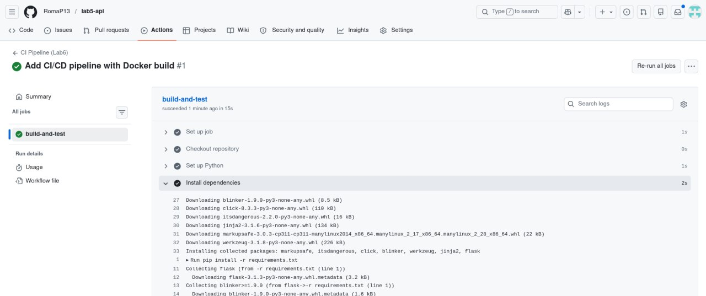
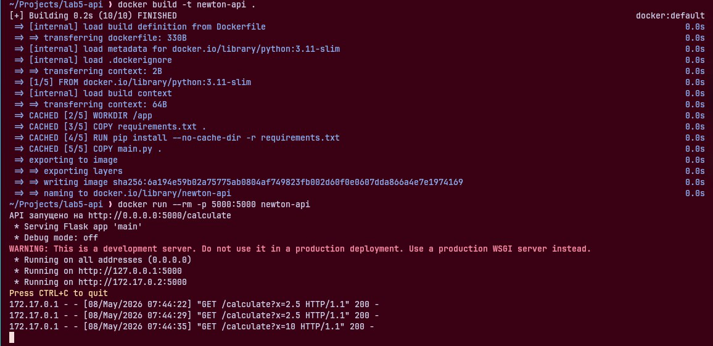
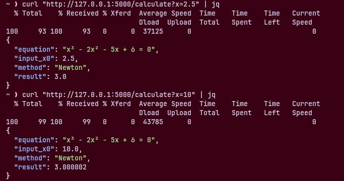

# Лабораторна робота №5: Створення простого API

## Автор

Помазан Роман, група АІ-233

## Модель

Метод Ньютона для розв’язання нелінійних рівнянь (5 семестр)

## Мета роботи

- Створити простий HTTP API для обчислювальної моделі
- Забезпечити доступ до методу Ньютона через веб-запит
- Підготувати модель для подальшого CI/CD та хмарного розгортання

## Файли проекту

- `main.py` — Flask API + реалізація методу Ньютона
- `requirements.txt` — залежності
- `Dockerfile` — для запуску API у контейнері
- `.github/workflows/ci.yml` — CI Pipeline

## Технології

- Flask API
- Docker
- GitHub Actions (CI/CD)

## CI/CD Pipeline

Репозиторій має автоматичний pipeline, який:

- Встановлює залежності
- Перевіряє синтаксис коду
- Збирає Docker-образ (`newton-api`)

## Статус CI/CD



## Як запустити

### Варіант 1: Через Docker (рекомендовано)

1. Зібрати Docker-образ:

```bash
docker build -t newton-api .
```

2. Запустити контейнер:

```bash
docker run --rm -p 5000:5000 newton-api
```

### Варіант 2: Локально

```bash
pip install -r requirements.txt
python main.py
```

## Тестування API (парний варіант — GET)

```bash
curl "http://127.0.0.1:5000/calculate?x=2.5"
```

## Результати виконання

Скріншот запуску сервера:



Скріншот успішного запиту curl:



## Висновки

У ході ЛР №5 було створено HTTP API на базі Flask для моделі «Метод Ньютона».

Реалізовано endpoint `/calculate` з передачею параметрів через URL.

API успішно працює як локально, так і у Docker-контейнері.

---

У ході ЛР №6 було налаштовано автоматичний CI/CD pipeline за допомогою GitHub Actions.

Pipeline автоматично перевіряє код та збирає Docker-образ при кожному push.
